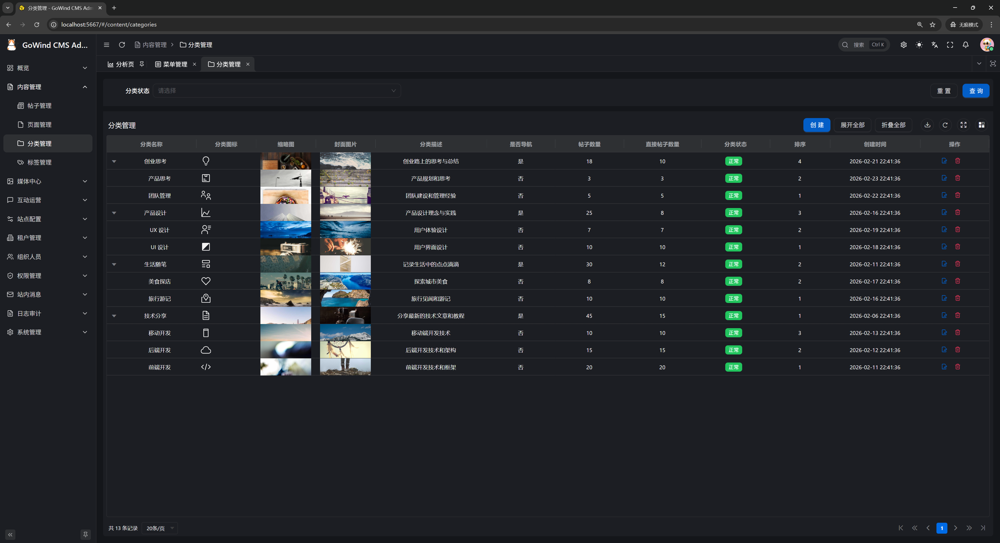
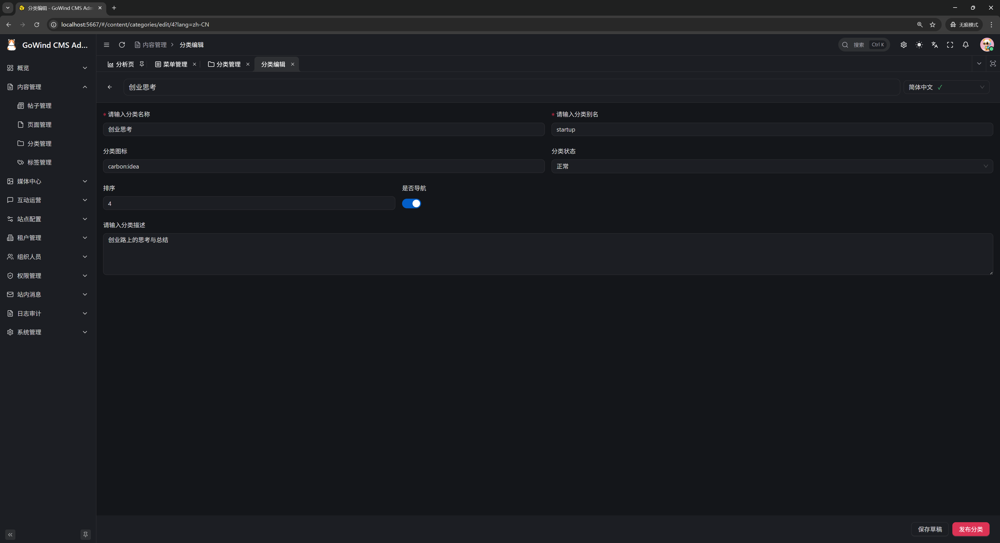

# GoWind Content Hub｜风行，开箱即用的企业级前后端一体内容平台

风行（GoWind HCH）是一款开箱即用的企业级Golang全栈Headless内容平台（HCH=Headless Content
Hub，无头内容中枢），为企业提供灵活、可扩展的全域内容管理与分发解决方案。

[English](./README.en-US.md) | **中文** | [日本語](./README.ja-JP.md)

## 演示地址

| 演示类型          | 访问地址                                                                                 |
|---------------|--------------------------------------------------------------------------------------|
| 后端管理前端        | [https://admin.cms.gowind.cloud](https://admin.cms.gowind.cloud)                     |
| 后端API Swagger | [https://api.admin.cms.gowind.cloud/docs/](https://api.admin.cms.gowind.cloud/docs/) |
| 默认账号密码        | `admin` / `admin`（所有演示地址通用）                                                          |
| 前台API Swagger | [https://api.cms.gowind.cloud/docs/](https://api.cms.gowind.cloud/docs/)             |
| 前台Vue端        | [https://cms.gowind.cloud](https://cms.gowind.cloud)                                 |
| 前台React端        | [https://react.cms.gowind.cloud](https://react.cms.gowind.cloud)                                 |
| 前台Taro端        | [https://taro.cms.gowind.cloud](https://taro.cms.gowind.cloud)                                 |

## 风行·核心技术栈

秉持高效、稳定、可扩展的技术选型理念，支持多前端技术栈适配，系统核心技术栈如下：

- 后端基于 [Golang](https://go.dev/) + [go-kratos](https://go-kratos.dev/) + [wire](https://github.com/google/wire) + [ent](https://entgo.io/docs/getting-started/)
- 管理后台前端基于 [Vue](https://vuejs.org/) + [TypeScript](https://www.typescriptlang.org/) + [Ant Design Vue](https://antdv.com/) + [Vben Admin](https://doc.vben.pro/)
- 前台展示前端支持多技术栈，当前已适配 [Vue3](https://vuejs.org/) + [TypeScript](https://www.typescriptlang.org/) + [Vite](https://vitejs.dev/) + [Naive UI](https://www.naiveui.com/)、[React](https://react.dev/) + [Next.js](https://nextjs.org/) + [Ant Design](https://ant.design/)
，后续将逐步增加 Taro、Uniapp 等小程序技术栈支持，灵活适配不同项目及终端需求

## 风行·核心功能列表

- 企业级多租户架构，支持多团队、多场景协同管理
- Headless无头架构，API优先设计，支持多端内容分发
- 多语言原生适配，完美支撑出海、跨境业务需求
- 可视化内容建模，自定义字段，灵活适配各类内容场景
- 企业级安全管控，精细化权限分配，保障内容资产安全
- 高性能Go后端加持，低延迟、高并发，适配企业级流量需求

## 风行·后台截图展示

<table>
    <tr>
        <td></td>
        <td></td>
    </tr>
    <tr>
        <td></td>
        <td></td>
    </tr>
    <tr>
        <td></td>
        <td></td>
    </tr>
    <tr>
        <td></td>
        <td></td>
    </tr>
    <tr>
        <td></td>
        <td></td>
    </tr>
    <tr>
        <td></td>
    </tr>
</table>

## 风行·前台截图展示

<table>
    <tr>
        <td></td>
        <td></td>
    </tr>
    <tr>
        <td></td>
        <td></td>
    </tr>
    <tr>
        <td></td>
        <td></td>
    </tr>
    <tr>
        <td></td>
        <td></td>
    </tr>
    <tr>
        <td></td>
        <td></td>
    </tr>
</table>

## 联系我们

- 微信个人号：`yang_lin_bo`（备注：`go-wind-cms`）
- 掘金专栏：[go-wind-cms](https://juejin.cn/column/7541283508041826367)

## [感谢JetBrains提供的免费GoLand & WebStorm](https://jb.gg/OpenSource)

